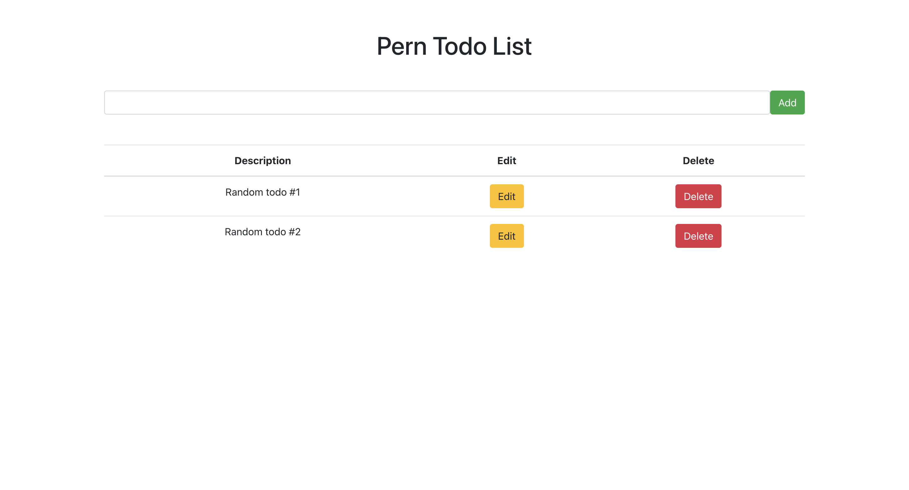
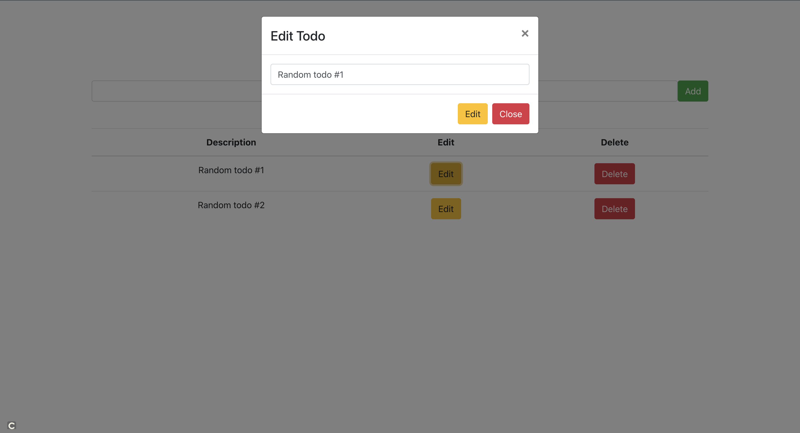

# Check it out:

https://todo-app-pern-stack-client.vercel.app/

# ABOUT THIS PROJECT:

This project is a todo application created with the PERN (PostgreSQL, Express, React, Node) stack. The app provides full CRUD functionality with todo tasks.

# HOW IT WAS BUILT:

The project is broken into a client side and server side of the application, both deployed using vercel. The client side of the application was created using React.

The server side of the application was built using express and node to create a RESTful API, which routes the DB requests to a PostgreSQL DB. The app integrates the PostgreSQL DB with an AWS RDS for global usage.

## Dependency Injection

This application integrates local PostgreSQL usage, as well as global/production deployment using AWS' PostgreSQL RDS. If cloning the repo and running local, create the database instance using server/database.sql and copy .env.example, replacing the 'PG_XXX' variables with your database connection information. Make sure to then change the server/db.js pool connection to the appropriate environment attributes.

###### Main Page

###### Edit Modal

